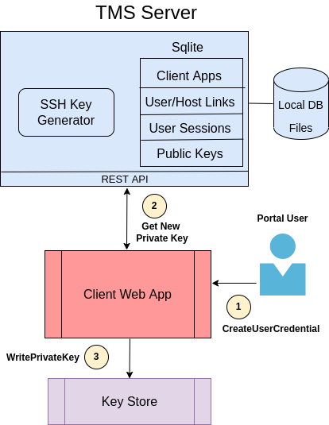

..
    Comment: Heirarchy of headers will now be!
    1: ### over and under
    2: === under
    3: --- under
    4: ^^^ under
    5: ~~~ under

.. raw:: html

    

.. role:: red

###########################
Architecture
###########################

Minimal Viable Product
======================

   **Figure 1 - TMS MVP Architecture**

Figure 1 shows the initial MVP release of the TMS architecture.  The MVP release is restricted in these ways:

   - Keys do not automatically expire or have a limited number of uses.
   - TMS does not automate MFA challenge/response.
   - User identities are the same as their login account name on all systems.
   - Only well-known client applications are allowed to use TMS.

The server supports an SSH key pair generator and an external database to persist application, user and host data. All server functions are delivered through REST interfaces. The server is written in Rust with well-defined internal interfaces that allow new authentication methods to be incorporated in a standardized way.

Hosts that support TMS-generated SSH keys will need their SSHD to be configured with the *KeyCmd* program to dynamically retrieve public keys from the TMS Server.  In :ref:`key_management_label`, we show how applications create SSH key pairs and use TMS as an on-demand, key escrow for public keys, which avoids the need to distribute those keys to hosts in advance.

Possible Future Extensions
==========================

   **Figure 2 - TMS Full Architecture**

Figure 2 shows the full TMS architecture diagram with a TMS Server configured with a Time-based One Time Password (TOTP) authenticator that allows applications to programmatically satisfy MFA challenges; a SSH key pair generator; a token generator; and experimental WebAuthn support. 

In addition to the capabilities discussed for the MVP version, the full architecture has these capabilities:

   - Automated MFA login for a configurable time period.
   - Keys with limited lifetimes and number of uses.
   - Federated IDP support.
   - A protocol that challenges users to authenticate on a host before their identity can be linked to that host and delegated to a client application.
   - Experimental credentials support, such as token login (such as SciTokens) and WebAuthn integration.
   - An optional non-SSH, agent-based communication channel between client applications and hosts.   

TMS is not itself an Identity Provider (IDP), but instead interacts with existing federated (e.g., InCommon) and institution-specific IDPs. Highlighted in bright dashed boxes are placeholders for experimental features such as JWT authentication (e.g., SciTokens), WebAuthn support or communication via an Agent installed on the host.

The command line program **tmsctl** is deployed on target host systems and is used to communicate with the TMS server during certain OAuth2 style flows. Associated with tmsctl is the **TMS Host Signer** daemon that provides a secure way to (1) identify the user account and host running tmsctl and (2) guarantee the integrity of data transmitted from tmsctl to the TMS server. 

Hosts that support generated SSH keys will need SSHD to be configured with the TMS Key Cmd program to dynamically retrieve public keys escrowed on the TMS Server. Hosts that support token login will need a custom PAM module installed to parse and validate tokens. This PAM module may be adapted from an existing implementation, such as SciTokens, or may be built from scratch. Hosts that support non-SSH based application authentication will need the TMS Agent installed.

.. _key_management_label:

##############
Key Management
############## 

Creating TMS Keys
=================

The following figure describes how TMS MVP is used by client applications---`Tapis`_ in this example---to create SSH key pairs.

   **Figure 3 - TMS Key Creation**

Step 1
------
An authenticated Tapis user issues a CreateUserCredential REST call to the Systems service to generate a key pair for a system they are authorized to use.

Step 2
------
The Systems service issues a /tms/pubkeys/creds REST call to the TMS Server (TMSS) to create a new SSH key pair.  TMSS will only honor the request if these conditions hold:

   1. The client application (Tapis in this case) is registered in a TMS tenant and presents its TMS generated client-id and client-secret to TMSS.  (Note: TMS tenants have no relationship to Tapis tenants.) 
   2. The user on behalf of whom the request is being made has a valid, unexpired MFA in effect.
   3. The user has previously linked their identity to an account on the host machine represented by the Tapis system.
   4. The user has previously delegated authority to the client application (Tapis) to act on their behalf on that host.

Only if all of these checks pass will TMSS generate a key pair.  Supported key types are RSA (4096 bits), ECDSA (521 bits) and ED25519 (256 bits); ED25519 being the default.  The client can also specify the number of uses and expiration time of the keys.  TMSS will put the new public key in its database, along with a fingerprint of the public key, and pass the private key back to the client.  

*Note that in the MVP release (1) all keys have unlimited uses and don’t expire, (2) user MFAs are implicit and never expire, (3) a user’s identity is always the same as their host account name, and (4) users implicitly delegate Tapis to act on their behalf.*

Step 3
------
The Systems service stores the private key returned from TMS by calling SK’s writeSecret endpoint.  SK allows only the System service (as identified by its service JWT) to store SSH keys used by Tapis to login to hosts.

Step 4
------
SK writes the private key to the Vault in a place that only the Systems service can access.  An important characteristic of this flow is that the portal user–or any end user for that matter–never sees or has access to the private key generated by TMS and used by Tapis to login to their host account.

.. _Tapis: https://tapis.readthedocs.io/en/latest/

Using TMS Keys
==============

The following figure describes how TMS MVP is used by client applications---`Tapis`_ in this example---to use SSH key pairs previously created.

   **Figure 4 - TMS Key Usage**

Step 1
------
An authenticated Tapis user issues a submitJob request to the Jobs service to run an application on a system.

Step 2
------
The Job service retrieves the system definition with user credentials by calling the Systems getSystem endpoint.  Only the Jobs and Files services, the two services that login to hosts on behalf of users, can access the credentials of a system.

Step 3
------
The System service issues a readSecret call to SK to retrieve the user’s private key for their host account from Vault.  This is done as part of the system definition retrieval request.

Step 4
------
SK reads the user’s private key from Vault.  

Step 5
------
After retrieving the system definition with the user’s credentials, Jobs initiates an SSH connection to the user’s account on the host using the private key retrieved from SK.

Step 6
------
The TMS KeyCmd module previously installed and configured on the target host is called by SSHD to provide a public key.  KeyCmd makes the /tms/pubkeys/creds/retrieve REST call to TMSS to retrieve the user’s public key.  The call’s parameters include the target host, account name and public key fingerprint.

TMSS will use the call parameters to match the unique public key in its database if one exists.  If found, TMSS will return the public key only if:

   1. The client application matches the client that originally created the key pair.
   2. The user on behalf of whom the client is executing has a valid, unexpired MFA in effect.
   3. The user has previously linked their identity to the host account on the host machine.
   4. The user has previously delegated authority to the client application (Tapis) to act on their behalf.

As in the previous flow, most of these checks will always succeed because of the limited function TMS version deployed for the MVP release.

Step 7
------
Upon successful retrieval of the public key by KeyCmd, SSHD establishes a login session with Jobs, which is then free to issue commands on the target host on behalf of the end user. 

#############
API
#############

TMS implements API on each of the resources it manages.

Online Documentation
====================
   
From a running TMS server, one can extract TMS's OpenAPI v3 specification and interact with its live API web page.  The links below are examples of those available to developers at the Texas Advanced Computing Center (TACC).  Similar links will work in any TMS installation by replacing the host in the URLs.

   - `JSON specification`_ -- Viewable OpenAPI specification
   - `YAML specification`_ -- Downloadable OpenAPI specification 
   - `API liveDocs`_ -- Interactive API web page 

.. _JSON specification: https://tms-server-dev.tacc.utexas.edu:3000/spec
.. _YAML specification: https://tms-server-dev.tacc.utexas.edu:3000/spec_yaml
.. _API livedocs: https://tms-server-dev.tacc.utexas.edu:3000

